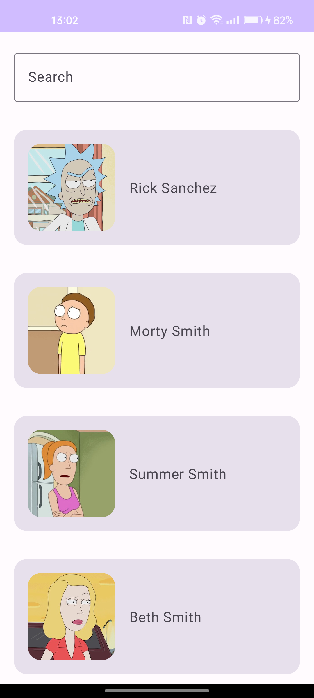
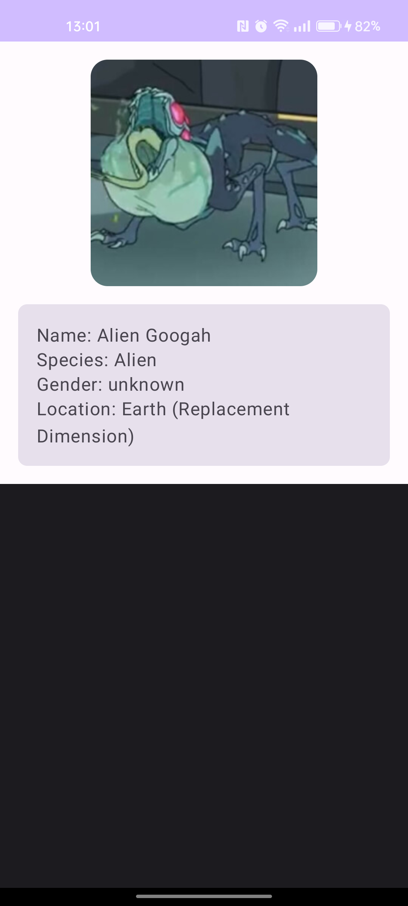

# Rick and Morty Character Browser

This is a sample Android app written in Kotlin using the Jetpack Compose UI toolkit, and following the modern Android development best practices with the MVVM architecture. The app uses the [Rick and Morty API](https://rickandmortyapi.com/) to display a list of characters, and provides more details when a character is selected.

## Features
- Browse a list of characters from the Rick and Morty series.
- View more detailed information on each character.
- Search for characters by their names.

## Technologies Used
- Kotlin
- Jetpack Compose
- Hilt for Dependency Injection
- Retrofit for networking
- MVVM architecture with ViewModel and LiveData
- Coroutines for asynchronous programming
- Coil for image loading

## Installation and Setup
1. Clone this repository using git.
2. Open the project in Android Studio.
3. Sync the Gradle files and build the project.
4. Run the project on an emulator or physical device.

## Screenshots

You might also want to include screenshots of your application. For example:

## License
This project is open-source and available under the [MIT License](LICENSE).
